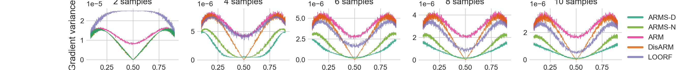

# ARMS: Antithetic-REINFORCE-Multi-Sample Gradient for Binary Variables
-----
This is the official code repository for ICML 2021 paper [ARMS: Antithetic-REINFORCE-Multi-Sample Gradient for Binary Variables](https://arxiv.org/pdf/2105.14141.pdf) by Alek Dimitriev and Mingyuan Zhou. 

If you use the code in this repository please correspondingly cite the paper:
```
@inproceedings{dimitriev2021arms,
  title = {ARMS: Antithetic-REINFORCE-Multi-Sample Gradient for Binary Variables},
  author = {Dimitriev, Alek and Zhou, Mingyuan},
  booktitle = {ICML: International Conference on Machine Learning},
  pages = {2717--2727},
  year = {2021},
  editor = {Meila, Marina and Zhang, Tong},
  volume = {139},
  series = {Proceedings of Machine Learning Research},
  month = jul,
  publisher = {PMLR},
  pdf = {https://arxiv.org/pdf/2105.14141.pdf},
  url = {https://proceedings.mlr.press/v139/dimitriev21a.html},
}
```
Supported datasets: Dynamic MNIST, Fashion MNIST, and Omniglot, with either a linear or nonlinear encoder/decoder pair. 
Supported gradients: ARM, DisARM, LOORF, RELAX and ARMS (Dirichlet copula) and ARMS_Normal (Gaussian copula). 

The figure below can be reproduced by running *python toy_problem.py*.


To run an experiment you can start with the below template:
```
python3 -m experiment_launcher \
    --dataset=omniglot \
    --logdir=../logs_test \
    --grad_type=arms \
    --encoder_type=nonlinear \
    --num_steps=1e6 \
    --num_pairs=3 \
    --demean_input \
    --initialize_with_bias \
```
